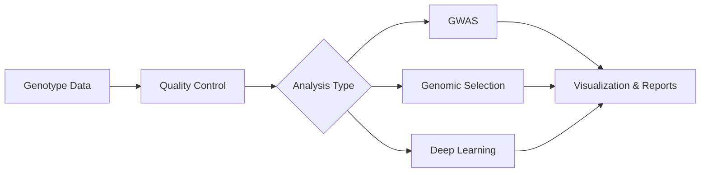

# AdvancedGenomics.jl (Updated: 2025-12-01)


**AdvancedGenomics.jl** is a high-performance Julia package designed for next-generation genomic analysis. It integrates state-of-the-art statistical methods with deep learning to solve complex problems in quantitative genetics and breeding.

## 🚀 Key Features

- **High Performance**: Optimized for massive datasets using multi-threading and GPU acceleration.
- **Comprehensive**: Unified framework for GWAS, Genomic Selection, and Deep Learning.
- **Flexible**: Modular design allows easy integration of new models and algorithms.

## 📦 Installation

> [!IMPORTANT]
> This package is **not registered** in the General Registry. You must install it directly from GitHub.

Open the Julia REPL and run:

```julia
using Pkg
Pkg.add(url="https://github.com/1958126580/AdvancedGenomics")
```

## 📚 Documentation

- [**User Manual**](manual.md): Detailed guide on how to use the package.
- [**API Reference**](api.md): Technical documentation for developers.

## 🧬 Workflow


