# AdvancedGenomics.jl


Welcome to the documentation for **AdvancedGenomics.jl**, a high-performance genomic analysis package written in Julia.

## 🌟 Overview

**AdvancedGenomics.jl** bridges the gap between classical quantitative genetics and modern deep learning, offering a unified framework for researchers and breeders. It is designed for:

- 🚀 **Speed**: Optimized BLAS/LAPACK operations and multi-threading.
- 📈 **Scale**: GPU acceleration for massive matrix operations.
- 🧠 **Innovation**: Integration of Transformers, GNNs, and Explainable AI (XAI).

## 🔄 Workflow

```mermaid
graph LR
    Data[🧬 Genotype Data] --> QC[🔍 Quality Control]
    QC --> GRM[Build GRM]
    GRM --> GWAS[📊 GWAS Analysis]
    GWAS --> Vis[📉 Visualization]

    Data --> GS[🎯 Genomic Selection]
    GS --> Pred[🔮 Prediction]

    Data --> DL[🤖 Deep Learning]
    DL --> XAI[💡 Explainable AI]
```



## 📦 Installation

> [!IMPORTANT]
> This package is currently **not registered** in the General Registry. You must install it directly from GitHub.

### Prerequisites

- Julia v1.9 or higher.
- (Optional) NVIDIA GPU with CUDA drivers for GPU acceleration.

### Installing via Package Manager

Open the Julia REPL and enter the package manager by pressing `]`. Then run:

```julia
pkg> add https://github.com/1958126580/AdvancedGenomics
```

Or using `Pkg` in a script:

```julia
using Pkg
Pkg.add(url="https://github.com/1958126580/AdvancedGenomics")
```

### 🎮 GPU Support

To enable GPU acceleration, you need to install `CUDA.jl` separately:

```julia
using Pkg
Pkg.add("CUDA")
```

Then, simply load `CUDA` before or after `AdvancedGenomics`:

```julia
using CUDA
using AdvancedGenomics
```

## ⚡ Quick Start

Here is a simple example of running a GWAS pipeline.

```julia
using AdvancedGenomics
using Random

# 1. Simulate Data 🎲
n_ind = 500
n_snps = 2000
G = simulate_genotypes(n_ind, n_snps)
y = randn(n_ind) # Random phenotype

# 2. Build GRM (Genomic Relationship Matrix) 🧬
K = build_grm(G)

# 3. Run GWAS using Linear Mixed Model 🏃
results = run_gwas(G, y, K)

# 4. Visualize Results 📊
manhattan_plot(results)
qq_plot(results)
```

## ✨ Features at a Glance

- **GWAS**: Linear Mixed Models (LMM), FarmCPU, BLINK, Logistic Regression.
- **Genomic Selection**: GBLUP, Bayesian Methods (BayesA/B/C/R), Machine Learning (RF, GBM).
- **Deep Learning**: Genomic Transformers, CNNs, GNNs.
- **Post-GWAS**: Fine-mapping, Pathway Enrichment, Meta-Analysis.
- **Population Genetics**: Haplotype Phasing, Ancestry Inference, ROH.

See the [User Manual](manual.md) for detailed usage instructions.
